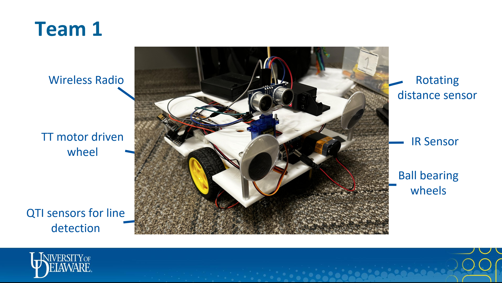

# Mechatronics Project
## Fire Fighting Robot

The repository consists of the Full details of the fire fighting robot project. The project demonstrates the respective fire fighting ronbot for the given enivronment and requirements based on the limited budget. It consists of all the details from design, code to materials used and a detailed report of steps and process. 

The following are illustrated in detail for your reference.

1. Problem Statement: 
    - The file [Problem_Statement.pdf](Proble_Statement.pdf) describes the problem statement, expectations and end goal of the project along with other details.

2. Bill of Materials:
    - The file [Bill_of_Materails.xlsx](Bill_of_Materials.xlsx) consists of all the components/ materials used for designing and building the robot. It also has the respective amazon purchase site link and cost (Suspected to change).

3. CAD:
    - The folder consists of all the CAD design files of different chassises models, Motor mounts and Microcontroller(Arduino) and sesnor mounts.  

4. Code: 
    - [Main.ion](Code\Main.ino) - This the main code file. It consists of all the Pin Connection variables and control commands for the motors, sesnors and integrate all to control the robot. It also calls other functions of the robot which accesses the other code files and runs it.
    - [distance_sesnor.ino](Code\distance_sensor.ino) - This code file contains the code to pass and recieve information from the HC-SR04 Ultrasonic (distance) sensor and process the data to detect the objects in front. 
    - [transmitter_V2.ino](Code\Main.ino) - It contains the code to tramist the signals from the joystick to the reciever mounted in the robot to control the motion and actuation of the ladder of the robot.
    - [Automation_(simulated).ino](Code\Automation_(Simulated).ino) - This code contains the attempt tomake the robot navigate itself autonomously based on the signal reception of the fire house and move onto the next one. 

5. Report:
    - The file [Mechatronics_Report_Team_1.pdf](Mechatronics_Report_Team_1.pdf) consists of all the design process, bill of materials, sensor integration and code explanations and step by step procedure for making the robot.

6. Media:
    - It consists of working videos of our Robot at each Milestones. 

7. Robot:
    - Displays the Robot's setup and sensors and how it is placed

    

8. Working Video:
    - [LINE_DETECTION.MOV](Media\LINE_DETECTION.MOV) displays the detection of lines.
        1. If the light glows Red the line detected count is one
        2. if it glows Blue the line count is 2
        3. if it glows Yellow it means it crossed the borders and bounds. 
 
    - [RADIO_SIGNAL.MOV](Media\RADIO_SIGNALS.mov) displays the working of Radio transmission signals from joystick to control the robot's motion (up, down, left, right and actuation of ladder)

    - [Final_Showdown.mp4](Media\Final_Showdown.mp4) displays the working video of the robot detecting the building on fire and breaking it by resolving it by dropping the ladder. 
